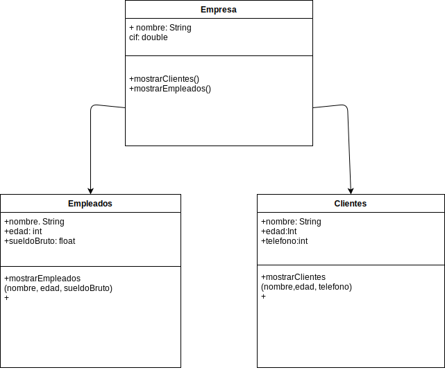

Tarea 1. Empleados de Empresa

Una aplicación guardará información sobre empresa, empleados y clientes. Estos dos últimos se caracterizan por nombre y edad.
Empleados tienen sueldo bruto, los empleados directivos tienen una categoría, así como un conjunto de empleados subordinados.
Clientes a mayores se necesita conocer teléfono de contacto.
Se necesita mostrar en la aplicación datos de empleados y clientes.

